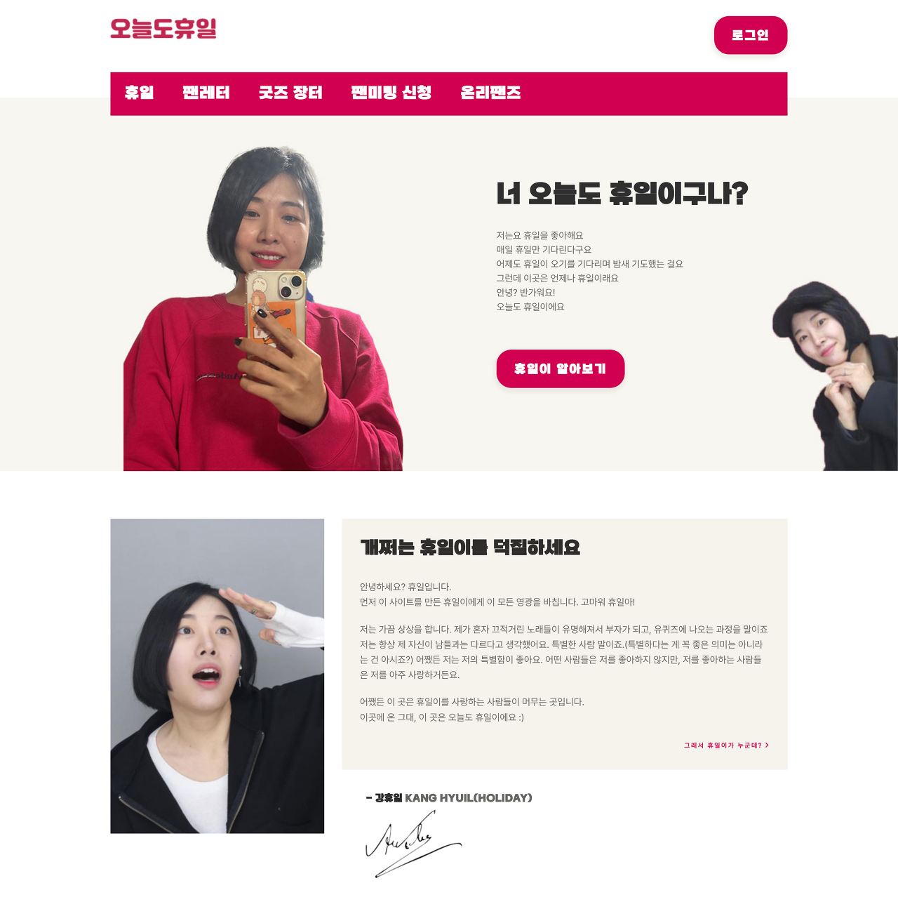

# 프로젝트 소개

세상에서 제일 멋진 휴일이의 팬들을 위한<br>
휴일이 팬 사이트
<br><br>



<aside>
🤩 1인으로 진행한 토이 프로젝트입니다. 오늘도 휴일은 휴일이의 팬들을 위한 서비스입니다. 휴일이의 지난 업적을 살펴보거나 팬레터를 작성할 수 있고, 굿즈 중고 장터에서 물건을 사고 팔 수 있습니다.

</aside>

<h2>작업자</h2>
강휴일 1인 개발

<h2>작업 기간</h2>
2023.03.07 ~ 2023.05.15

## 🕹️ 기술 스택

- Java , Spring Boot, Spring Security
- JWT, OAuth2
- MySQL , JPA
- Thymeleaf

## 🤗 역할

- **1인 개발**
- 기획부터 DB 설계, 기타 모든 작업 1인 진행
  - JWT 인증 로그인 및 회원가입(OAuth2) , 비밀번호 변경
  - 이미지 포함 게시판 CRUD 와 List , 댓글 작성 및 삭제
  - AWS EC2 배포와 Route53 도메인 연결, 기타 S3 및 RDS 사용

<h2>주소</h2>
*페이지 확인(https://hyuil.tistory.com/199)<br><br>
<br>


<h2>주요 기능</h2>

<h3>로그인 회원가입</h3>

```swift
회원가입
- 기본 정보 (아이디 등) 중복 확인 후 가입
- 회원가입 시 이메일 인증 코드 받아야 가입 가능
- OAuth2 회원가입 구현 (SNS 간편 회원 가입)

로그인
- SpringSecurity Filter 를 이용해 JWT 로그인 인증
- 로그인 시 전에 있던 페이지로 리디렉션 하는 기능 추가
- OAuth2 로그인 시
 * 리디렉션 정보를 주기 위해 OAuth2AuthorizationRequestResolver 구현
 * 해당 클라이언트(SNS)에게 유저 정보 받기 위해 OAuth2AuthorizationCodeGrantFilter 구현
```


<h3>게시판</h3>


```swift
팬레터
- 다중 이미지 업로드 가능
- 업로드 이미지는 AWS S3 서버에 저장

댓글
- ajax 를 이용한 비동기 통신
- 작성 후 댓글 창 부분만 리로드
- 대댓글 작성 가능
```

<h3>기타</h3>


```swift
- 여러 컨트롤러에서 반복되는 중복 코드 줄이기 위해 WebService 구현
 * Session 에서 id 를 가져오는 코드
 * ResponseEntity 를 보내는 코드
 * 특정 Dto 를 Null Check 하는 코드 등 ...

- 런타임 예외 컨트롤을 편하게 하기 위해 사용자 정의 예외 구현
 * MemberNotFoundException - 회원을 찾지 못했을 때
 * ThisEntityIsNull - Entity 가 Null 일 때
 
- JPA 페이징 기능(Pageable)을 이용하기 위해 JPARepository 이용

- AWS RDS 이용

- DB 에 정보를 남겨두기 위해 delete 문 사용 대신 remove_date 등을 이용
 * remove_date 가 Null이 아닐 경우 삭제 된 데이터로 간주, 서버에 보여주지 않음
 
- Thymeleaf 레이아웃 기능 이용으로 중복되는 Header, Footer 등을 따로 관리

- Postman 을 이용하여 프론트 적용 전 임의의 데이터를 보내 테스트
```
<br>

## 프로젝트를 진행하며…

### 🙌 **개인적인 목표**

- JWT 인증을 구현해보고 싶다.
  - [JWT 를 이용한 로그인 회원 가입 구현](https://hyuil.tistory.com/188)
- SNS 로그인(OAuth2 인증)을 구현해보고 싶다.
  - [SNS 로그인 + JWT + Redirect 기능 구현](https://hyuil.tistory.com/193)
    - Redirect 기능을 넣고 싶은 욕심에 OAuth2AuthorizationRequestResolver 구현

- JPA 를 반드시 사용해보고 싶다.
  - [Pageable 객체를 이용한 게시판 페이징](https://hyuil.tistory.com/192)
- AWS 를 이용한 배포를 해보고 싶다.
  - [도메인 구매 후, 오늘도 휴일 배포 완료.](https://alwaysalsoholiday.com/) (현재 Server OFF)

### 😵 힘들었던 점

- **JWT 이해가 힘들어서 개발 진행이 막혔다.**
  - 검색을 하면 관련 코드들이 나오지만 과연 그들이 JWT 이해하고 코드를 작성했나 믿을 수 없었다.
  - 정확하고 믿을만한 정보가 필요하다. 블로그는 믿을 수 없다.

🤖 ”스프링 시큐리티 인 액션” 서적을 구매하여 학습 후 진행

- **JWT 를 활용한 OAuth2 로그인 구현이 어려웠다.**
- **게다가 OAuth2 에서 Redirect 기능을 꼭 구현하고 싶은데 어떤 Filter 들이 어떤 방식으로 동작하는지 이해가 힘들었다.**
  - ChatGPT 를 활용하여 어떤 Filter 들이 있고 어떤 기능을 하는지 알아보았다.
    - ChatGPT 의 말은 **무조건 걸러들어야 한다**. 진짜인지 확인하는 작업을 거쳤다.
  - 기존에 구현했던 JWT 구현을 응용해 OAuth2 에 맞게 적용했다.
  - 각 Client Server 에 있는 가이드를 활용해 클라이언트마다 어떤 방식으로 인증을 하는지 보고 각 클라이언트만의 방식으로 구현했다.

😸 Resolver 와 GrantFilter 를 직접 구현하여 Redirec 의 경우 로그인 후 Redirect 하도록 구현 !

### **👏 현재 이렇게 개선 중이에요**

- [JPA 관련 코드 개선](https://github.com/h0l1da2/always_also_holiday/commit/322a11df4ad4602d890f04930a96c8390d886913)
- [객체지향에 맞도록 MailService 코드 개선](https://hyuil.tistory.com/204)
- 3.0 마이그레이션 후, Junit5 를 이용한 [Service Test](https://hyuil.tistory.com/212) 와 [Controller Test](https://hyuil.tistory.com/213)
  - [실제로 Test 후, 오류를 잡고 수정.](https://hyuil.tistory.com/214)

**→ 지금도 꾸준히 리팩토링 진행중 🤗**

[https://hyuil.tistory.com/category/토이 프로젝트) 오늘도 휴일](https://hyuil.tistory.com/category/%ED%86%A0%EC%9D%B4%20%ED%94%84%EB%A1%9C%EC%A0%9D%ED%8A%B8%29%20%EC%98%A4%EB%8A%98%EB%8F%84%20%ED%9C%B4%EC%9D%BC)